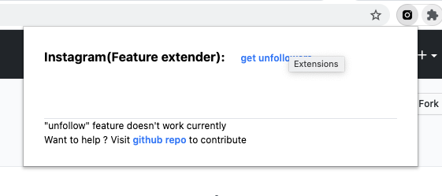
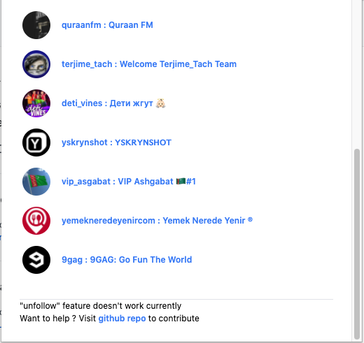

## Google Chrome Extension: instagram feature extension.

## Installation:

#### Chrome extension store:

This `extension` had been submitted to google extension store to publish, its under the review.

#### Git Clone:
1) `git clone https://github.com/7urkm3n/instagram-feature-extension`
2) Go to `chrome://extensions/`
3) Toggle `Developer mode`, right top corner.
4) Click `Load unpacked`
5) Chose the location of the clonned app. 
6) Hola, enjoy and contribute :) 

### Usage:

User have to be signed-in, in the browser. This app uses cookies to get, current signed-in `userID`.

### Available features:
* unfollowers list
* unfollow under construction

Incoming changes: Planning to use `instagram-private-api`, feel free to contribute, this project is going to be free to use always. 

I would love to have a help to design the app and further more features like (unfollow, dm, download a content etc...)

___

